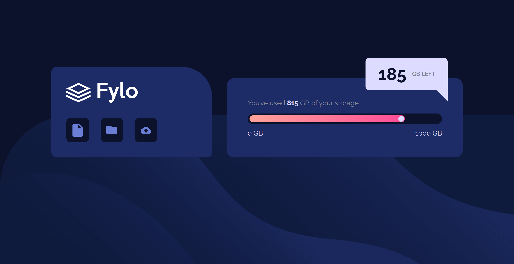

# Frontend Mentor - Fylo data storage component solution

This is a solution to the [Fylo data storage component challenge on Frontend Mentor](https://www.frontendmentor.io/challenges/fylo-data-storage-component-1dZPRbV5n).

## Table of contents

- [Overview](#overview)
  - [Screenshot](#screenshot)
  - [Links](#links)
- [My process](#my-process)
  - [Built with](#built-with)
  - [What I learned](#what-i-learned) 
  - [Useful resources](#useful-resources)
- [Author](#author)
- [Acknowledgments](#acknowledgments)

## Overview
 

### Screenshot

 

### Links

- Solution URL: [solution](https://github.com/KenawMarie/front-fylo-data-storage-component)
- Live Site URL: [Live site](https://kenawmarie.github.io/front-fylo-data-storage-component/)

## My process

### Built with

- Semantic HTML5 markup
- CSS custom properties
- Flexbox 
- CSS Positioning
- Pseudo elements

 

### What I learned

The new thing i learn from this project is how to work with meter element and how to style it and how to form triangle using border.

### Useful resources

- [CSS-TRICKS:- The HTML5 meter Element](https://css-tricks.com/html5-meter-element/) - This show me how to style meter element. 

- [Stack Overflow](https://stackoverflow.com/questions/18531959/how-to-create-triangle-shape-in-the-top-right-angle-of-another-div-to-look-divid) - This show me how to form triangle using the border property. 

## Author

- Website - [The Odin Project](https://www.theodinproject.com/dashboard)
- Frontend Mentor - [@kenawMarie](https://www.frontendmentor.io/profile/kenawMarie) 
 

## Acknowledgments

Thanks to the frontend mentor for this challenge.